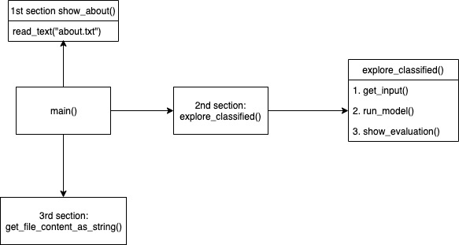
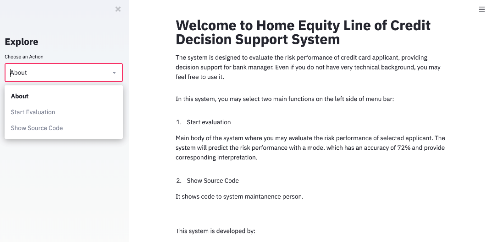

# Decision support system (DSS) for evaluating the risk of Home Equity Line of Credit (HELOC) applications

**Project description:** 

This decision support system is designed to help bank managers predict risk performance of a credit card aplicant. In this project, I trained the predictive model with dataset first and then visualized the system with Streamlit. Bank managers not only can get decision support but also explaination from this system.


## 1. About Dataset

I use a real-world financial dataset provided by FICO with 14060 rows and 23 variables. The predictor variables are all quantitative or categorical, and come from anonymized credit bureau data. The target variable to predict is a binary variable called RiskPerformance. The value “Bad” indicates that a consumer was 90 days past due or worse at least once over a period of 24 months from when the credit account was opened. The value “Good” indicates that they have made their payments without ever being more than 90 days overdue. More details about dataset can be found [here](https://community.fico.com/s/explainable-machine-learning-challenge).

## 2. Predictive Model Training

### 2.1 Prepare data

#### 2.1.1 Data Scaling

The dataset Homeline of Credit contains features highly varying in magnitudes, units and range. But since, most of the machine learning algorithms use Eucledian distance between two data points in their computations, this is a problem.

If left alone, these algorithms only take in the magnitude of features neglecting the units. The features with high magnitudes will weigh in a lot more in the distance calculations than features with low magnitudes.To suppress this effect, I need to control all features on the same level of magnitudes. This can be achieved by scaling.

Here I use the most common method StandardScaler(). Standardisation replaces the values by their Z scores.

This redistributes the features with their mean = 0 and standard deviation =1 . sklearn.preprocessing.StandardScaler helps me implementing standardisation in python.

#### 2.1.2 How to deal with special values (-7,-8,-9) in the dataset

From the data dictionary file, we know that ‘-7’ represents condition not Met (e.g. No Inquiries, No Delinquencies), -9 represents no Bureau Record or No Investigation and -8 represents no Usable/Valid Accounts Trades or Inquiries. There are a bunch of young people that do not have previous credit record before they apply for loan or credit cards. So we cannot arbitarily drop those data. Instead, we should remind the bank that though these people might be predicted as ‘Good’, it might be unknown risk to allow those people to apply for large number of loan.

### 2.2 Model Comparison

The core method of our model selection is using GridSearchCV function to find out the model with highest CV score.

We first tried on single model include Decision tree, Logistic regression, KNN and SVM, and fine-tuned our model by trying different hyper-parameters until we found out the best one. Among all the single models, comparing both their CV scores and accuracy, SVM(rbf) has the best performance.

In order to further improve our accuracy, we then applied the aggregation method to our model training, which includes Boosting, Random Forest and Bagging models. Since SVM(rbf) performs really well in our single model training, we decided to use SVM(rbf) with the best hyper-parameters we found in the previous step as the base estimator of our bagging model. It is not surprising that all the three models have high CV scores and accuracy comparing to the single model method. Among them, the bagging model has the best performance. So we decided to choose the bagging model as our risk evaluation model, which has approximately 71.86% accuracy.

The following table shows the best estimator, CV score and accuracy of each model we have trained.


## 3.Interactive interface design

The interface includes three sections on the left side of menu bar: About, Start Evaluation and Show Source Code. Main() function will call corresponding function when users choose an action.





```javascript
if __name__ == "__main__":
	
    X_test = pickle.load(open('data/X_test.sav', 'rb'))
    y_test = pickle.load(open('data/y_test.sav', 'rb'))
    X_train = pickle.load(open('data/X_train.sav', 'rb'))
    y_train = pickle.load(open('data/y_train.sav', 'rb'))
    X_train_df = pd.DataFrame(X_train)
    X_test_df = pd.DataFrame(X_test)
    y_train_df = pd.DataFrame(y_train)
    y_test_df = pd.DataFrame(y_test)

	# execute
    main()

def main():
	'''Set main() function. Includes sidebar navigation and respective routing.'''

	st.sidebar.title("Explore")
	app_mode = st.sidebar.selectbox( "Choose an Action", [
		"About",
		"Start Evaluation",
		"Show Source Code"
	])
  
	# nav
	if   app_mode == "About":            show_about()
	elif app_mode == "Start Evaluation": explore_classified()
	elif app_mode == "Show Source Code": st.code(get_file_content_as_string())
```


### 3.1 About section

#### 3.1.1 What this page is for
This section provides brief introduction of prediction goal and 2 other sections of the decision support system.

#### 3.1.2 Technical realization 
Since default value for sidebar is “about”, main() will call show_about() automatically. show_about() will call read_text() to write “about.txt” on the screen.


### 3.2 Start Evaluation


#### 3.2.1 What this page is for
This section is the main body of system for users to get decision support provided by our model. Since users in real life only use model with best accuracy and we assume that users do not have technical background, we put only one model in our system.

There are three steps for using this system. Firstly, users choose data from dataset for prediction. If necessary, for example when dataset is not updated in time or applicant doesn’t have corresponding historical record, users may input data manually. Secondly, users click “get evaluation result” to run model. Thirdly, users will get result (either “good” or “bad”) and future interpretation which explains the prediction result.

#### 3.2.2 Technical realization 
Since default value for sidebar is “about”, main() will call show_about() automatically. show_about() will call read_text() to write “about.txt” on the screen.

explore_classified() will call following functions conditionally:

##### 3.2.2.1 get_input()

get_input() provides sidebar and records data users input or choose from dataset.

##### 3.2.2.2 run_model()

run_model() will get data from get_input() and use input data to run model which performs best in our training.

##### 3.2.2.3 show_evaluation()

show_evaluation() will receive result from run_model() and provide interpretation.

When result is 1， which means ‘Good’, the likelihood of repayment is predicted to be high. A loan or a credit card application could be approved. However, there is some problem with the missing value, which is -7,-8 and -9. These value means there is ‘ No Bureau Record or No Investigation’, or ‘No Usable/Valid Accounts Trades or Inquiries’, or condition not met. These people are usually young and this is their first time applying for loa or credit card. Considering that there is no enough historical data to refer to, we should warn banks about the risk.

When result is ‘Bad’, the likelihood of repayment is predicted to be low. A loan or a credit card application should be turned down. To find the reason that cause these people to be refused from loan or credit, we need to use information about standard normal distribution. First, we calculate the mean and standard deviation of each variable in the training set. Then we compute the possibility of X<predict value, which is Pr(X < x), to quantify how far our tobe-estimated term is from the population mean. If Pr(X < x) > 0.5, Pr(X < x) = 1 - Pr(X < x). Then we choose the first far variables and detect whether they are more than 2 standard deviation from the mean, which is the data center. However, in running the code we find that most values, even those belonging to ‘Bad’ people, are still within 2 standard deviation of mean. So we only use the possibility, and choose the first three to be the reason why these people is predicted to have low likelihood of repayment. Reasons that cause the result are provided to help applicants improve their financial status.

### 3.3 Show Source Code


#### 3.3.1 What this page is for

This section prints source code of program as a reference to users with technical background and to developers who maintain and improve the system.

#### 3.3.2 Technical realization

After calling get_file_content_as_string(), it will use urllib.request.urlopen(url) to download the raw code we uploaded and make its content available as a string.


Sed ut perspiciatis unde omnis iste natus error sit voluptatem accusantium doloremque laudantium, totam rem aperiam, eaque ipsa quae ab illo inventore veritatis et quasi architecto beatae vitae dicta sunt explicabo. 

```javascript
if (isAwesome){
  return true
}
```

### 2. Assess assumptions on which statistical inference will be based

```javascript
if (isAwesome){
  return true
}
```

### 3. Support the selection of appropriate statistical tools and techniques


### 4. Provide a basis for further data collection through surveys or experiments

Sed ut perspiciatis unde omnis iste natus error sit voluptatem accusantium doloremque laudantium, totam rem aperiam, eaque ipsa quae ab illo inventore veritatis et quasi architecto beatae vitae dicta sunt explicabo. 

For more details see [GitHub Flavored Markdown](https://guides.github.com/features/mastering-markdown/).
